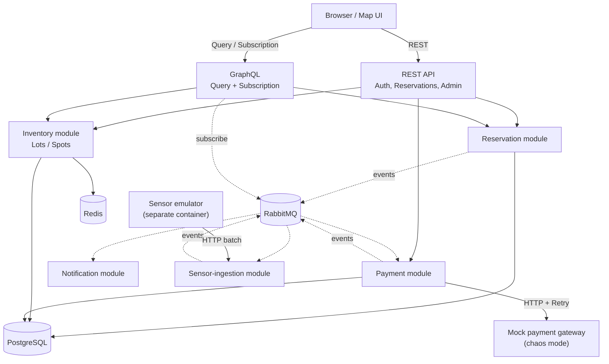

# 🅿️ ParkFlow

[](https://github.com/rostikdiv/parkflow/actions/workflows/ci.yml)
[](https://openjdk.org/projects/jdk/21/)
[](https://spring.io/projects/spring-boot)
[](https://www.postgresql.org/)
[](LICENSE)

> A real-time parking reservation system with an interactive live map. Users see parking lots, check spot availability updated by simulated IoT sensors, and book a specific spot for a time range — all with WebSocket-based live updates.

---

## 🚀 Live Demo

| Service | URL |
|---|---|
| **Frontend** | https://parkflow-udqb.vercel.app |
| **REST API (Swagger UI)** | https://parkflow-backend-258044247462.us-central1.run.app/swagger-ui.html |
| **GraphiQL** | https://parkflow-backend-258044247462.us-central1.run.app/graphiql |

> **Note on cold starts:** Backend runs on Google Cloud Run (scales to zero). First request may take ~5–10s to wake up. The frontend displays a graceful "warming up" screen during this time.

---

## 🎥 Demo

<video width="100%" autoplay loop muted playsinline>
  <source src="./docs/demo.mp4" type="video/mp4">
  Your browser does not support the video tag.
</video>

> 🎥 *Live demo available at [parkflow-udqb.vercel.app](https://parkflow-udqb.vercel.app)*

---

## 🏗️ Architecture

A **modular monolith** (Spring Boot) divided into bounded domain modules (`reservation`, `inventory`, `payment`, `sensor-ingestion`, `notification`). Modules communicate exclusively via RabbitMQ events — the same loose coupling as microservices, without the operational overhead of separate deployments.

```
Browser / Map UI
      │
      ├─── REST API ──────────► Reservation Module ──► PostgreSQL
      │    (Auth, Bookings,              │
      │     Admin, Sensors)              └─── [RabbitMQ] ──► Payment Worker
      │                                                           │
      └─── GraphQL ───────────► Inventory Module ──► Redis Cache  │
           (Query + WebSocket                                     ▼
            Subscription)                                 Mock Gateway
                                                          (Chaos Mode)
Sensor Emulator ──► /api/internal/sensor-events ──► Sensor Ingestion
(separate container)          │                         │
                              │                         └──► [RabbitMQ] ──► GraphQL Subscription
                              │                                             (WebSocket to browser)
                              └──────────────────────────────► PostgreSQL (SensorEvent log)
```

### System Design Diagram



---

## 🛠️ Tech Stack

| Layer | Technology |
|---|---|
| **Language** | Java 21 (Virtual Threads, Sealed Classes, Record Patterns) |
| **Framework** | Spring Boot 3.4 |
| **GraphQL** | Spring GraphQL (Query + WebSocket Subscription) |
| **Database** | PostgreSQL 16 + Spring Data JPA + Flyway migrations |
| **Cache** | Redis (cache-aside, active invalidation on reservation events) |
| **Messaging** | RabbitMQ (topic/direct exchanges + Dead-Letter Queues) |
| **Resilience** | Resilience4j — Retry, Circuit Breaker, Rate Limiter |
| **HTTP Client** | `java.net.http.HttpClient` (built-in, Java 11+) |
| **Observability** | Spring Actuator + Prometheus + Grafana + Micrometer Tracing + Zipkin |
| **Security** | Spring Security + JWT (stateless) |
| **API Docs** | SpringDoc OpenAPI 3 (Swagger UI) |
| **Testing** | JUnit 5 + Testcontainers (PostgreSQL, RabbitMQ, Redis) |
| **Frontend** | React 18 + Vite + TypeScript + Leaflet + `urql` (GraphQL/WS) |
| **Infrastructure** | Docker Compose (local) + Terraform (GCP: Cloud Run, Cloud SQL, Compute Engine) |
| **CI/CD** | GitHub Actions + Workload Identity Federation (keyless GCP auth) |

> Built on GCP. Concepts (Terraform modules, IAM, managed services, CI/CD pipelines) transfer directly to AWS/Azure.

---

## 🧪 Hard Problems I Deliberately Solved

### 1. Race Condition on Overlapping Bookings
`@Version` optimistic locking serializes **all** reservations for a spot — even those that don't overlap in time. A 50-thread race test proves a 3-level decision ladder:

| Level | Mechanism | Why it's not enough |
|---|---|---|
| 1 | `ReentrantLock` per `spotId` | Doesn't scale beyond a single instance |
| 2 | `@Version` optimistic locking | Too coarse — unnecessary conflicts for non-overlapping slots |
| **3 (production)** | `EXCLUDE USING gist (spot_id, tstzrange(start, end) WITH &&)` | Atomically rejects only truly overlapping intervals at the DB level |

```sql
-- V4__add_reservation_exclusion_constraint.sql
ALTER TABLE reservations
    ADD CONSTRAINT no_overlapping_reservations
    EXCLUDE USING gist (
        spot_id WITH =,
        tstzrange(start_time, end_time, '[)') WITH &&
    )
    WHERE (status NOT IN ('EXPIRED', 'CANCELLED'));
```

> **`btree_gist` footnote:** `EXCLUDE USING gist` on a `uuid` column requires the `btree_gist` PostgreSQL extension — pure GiST doesn't support equality operator for UUID without it. The extension is installed in `V1__extensions.sql`, which must run before `V4` — a migration ordering constraint that bites if you get it wrong.

```sql
-- V1__extensions.sql (must precede the exclusion constraint migration)
CREATE EXTENSION IF NOT EXISTS btree_gist;
```

### 2. Idempotency on Duplicate Submissions
Two-layer guard against double-booking from network retries or button double-clicks:

```
Client sends Idempotency-Key (UUIDv4) header
  → Redis SETNX "processing" EX 300    ← fast fail-fast before DB transaction
    → If key exists → 409 Conflict
    → If new → create reservation
      → After commit: Redis SET {reservationId} EX 86400
  → PostgreSQL unique constraint on idempotency_key ← durable fallback if Redis fails
```

Redis is the fast path; Postgres is the safety net. Both layers are intentional — Redis `SETNX` stops races before the DB transaction even starts; the DB constraint is the durable guarantee if Redis is unavailable or TTL misfires.

### 3. Domain Status Modeling with Sealed Classes + JPA Limitation
Reservation statuses modeled as a `sealed interface` — the compiler enforces exhaustive handling of every state transition, eliminating entire classes of runtime bugs.

> **Conscious limitation:** JPA doesn't map sealed hierarchies directly. The DB stores a plain `VARCHAR` enum column; sealed types are reconstructed in the domain layer via an exhaustive `switch` mapper. This is a deliberate architectural choice ("DB stores the fact, domain models the behavior"), not a workaround.

```java
public sealed interface ReservationStatus {
    record Pending(Instant createdAt)                        implements ReservationStatus {}
    record Confirmed(Instant confirmedAt, String paymentRef) implements ReservationStatus {}
    record Active(Instant checkedInAt)                       implements ReservationStatus {}
    record Completed(Instant completedAt)                    implements ReservationStatus {}
    record Expired(String reason)                            implements ReservationStatus {}
    record Cancelled(String cancelledBy, Instant at)         implements ReservationStatus {}
}

// No `default` branch — compiler guarantees all states are handled
static ReservationStatus onPaymentSuccess(ReservationStatus s, String ref) {
    return switch (s) {
        case Pending p   -> new Confirmed(Instant.now(), ref);
        case Confirmed c -> throw new IllegalStateException("already confirmed");
        case Active a    -> throw new IllegalStateException("already active");
        case Completed c -> throw new IllegalStateException("finished");
        case Expired e   -> throw new IllegalStateException("expired");
        case Cancelled c -> throw new IllegalStateException("cancelled");
    };
}
```

### 4. CQRS-lite: Right Tool for Each Operation
- **REST** for commands (write path): `POST /api/v1/reservations`, `DELETE`, mutations — simple, cacheable, predictable HTTP semantics.
- **GraphQL** for queries and real-time (read path): `Query { parkingLot { spots { availability } } }` returns exactly the fields the UI needs. `Subscription { spotStatusChanged(lotId) }` streams live sensor updates over WebSocket without polling.

### 5. Graceful Degradation under Infrastructure Failures
| Failure | System Behavior |
|---|---|
| RabbitMQ down | REST bookings still succeed; payment processing pauses and resumes on reconnect |
| Redis down | Availability queries fall through to PostgreSQL (slower, but correct) |
| Payment gateway errors | Resilience4j Retry (exponential backoff) → Circuit Breaker (auto-opens at 50% failure rate) → `Reservation.EXPIRED` + spot released |
| Sensor emulator silent | `ReconciliationService` detects `SENSOR_SILENT` anomaly after configurable timeout → spot marked `UNKNOWN` |

### 6. Virtual Threads + RabbitMQ: The Non-Obvious Configuration
`spring.threads.virtual.enabled=true` enables Virtual Threads for the web container (Tomcat) — but **not** for RabbitMQ listeners. The `@RabbitListener` container has its own thread pool, completely separate from the web layer. Without explicit configuration, message consumers run on platform threads and pin under blocking I/O, defeating the purpose.

Fix: explicitly wire a Virtual Thread executor into `SimpleRabbitListenerContainerFactory`:

```java
// RabbitMQConfig.java
factory.setTaskExecutor(Executors.newVirtualThreadPerTaskExecutor());
```

This matters for payment workers and sensor-ingestion consumers that do JDBC and HTTP calls — both blocking operations that benefit from virtual thread scheduling.

### 7. Rate Limiter on Public Search and Auth Endpoints
The bbox-based parking lot search (`GET /api/v1/parking-lots?bbox=minLng,minLat,maxLng,maxLat`) is the highest-traffic public endpoint — no auth required, called on every map pan. The auth endpoint is the most abuse-prone. Both are protected by a shared Resilience4j `RateLimiter` instance named `authService`:

```yaml
resilience4j.ratelimiter:
  instances:
    authService:              # shared instance: covers both /auth and /parking-lots bbox search
      limitForPeriod: 10
      limitRefreshPeriod: 15m
      timeoutDuration: 0s   # fail immediately, don't queue
```

Exceeding the limit returns `429 Too Many Requests`.

### 8. Sensor Reconciliation
A `@Scheduled` job (every 2–5 min) compares sensor events against active reservations and detects anomalies using pure deterministic business rules on time windows:

| Anomaly Type | Condition |
|---|---|
| `OCCUPIED_WITHOUT_RESERVATION` | Sensor reports OCCUPIED, no active booking exists |
| `RESERVED_BUT_EMPTY_TOO_LONG` | Active booking, sensor FREE for >15 min (no-show) |
| `SENSOR_SILENT` | No sensor events for configurable period |

### 9. Reservation Audit Log (JSONB, Append-Only)
Every status transition is recorded in `reservation_audit` — an append-only table with a `JSONB metadata` column for flexible context:

```sql
CREATE TABLE reservation_audit (
    id             UUID PRIMARY KEY,
    reservation_id UUID NOT NULL,
    from_status    VARCHAR,
    to_status      VARCHAR,
    triggered_by   VARCHAR,  -- USER | SYSTEM | SENSOR | PAYMENT
    metadata       JSONB,
    created_at     TIMESTAMPTZ DEFAULT NOW()
);
```

H2 in-memory doesn't support `JSONB` — this is one of the direct arguments for Testcontainers over H2 for integration tests.

---

## 🚀 Run Locally

**Prerequisites:** Docker, Java 21, Node.js 20+

```bash
# Clone the repo
git clone https://github.com/rostikdiv/parkflow.git
cd parkflow

# Copy and configure environment
cp .env.example .env
# Fill in JWT_SECRET (any 32+ char string for local dev)

# Start infrastructure + backend
docker-compose up -d --build

# Start frontend dev server
cd frontend
npm install
npm run dev
# → Open http://localhost:5173
```

**Default credentials:**
- Admin: `admin@parkflow.com` / `password`
- User: `user@parkflow.com` / `password`

> ⚠️ **Change all default passwords before any public deployment.**

**Get a JWT token:**

*PowerShell (Windows):*
```powershell
$token = (Invoke-RestMethod -Method POST -Uri "http://localhost:8080/api/v1/auth/login" `
  -ContentType "application/json" `
  -Body '{"email":"admin@parkflow.com","password":"admin123"}').token
$token
```

*bash/Linux/macOS:*
```bash
curl -s -X POST http://localhost:8080/api/v1/auth/login \
  -H "Content-Type: application/json" \
  -d '{"email":"admin@parkflow.com","password":"admin123"}' | jq .token
```

**Make an authenticated request:**

*PowerShell:*
```powershell
Invoke-RestMethod -Uri "http://localhost:8080/api/v1/admin/reservations" `
  -Headers @{ Authorization = "Bearer $token" }
```

*bash:*
```bash
curl -H "Authorization: Bearer <your-token>" \
     http://localhost:8080/api/v1/admin/reservations
```

**Services:**
| Service | URL |
|---|---|
| Frontend | http://localhost:5173 |
| Backend API | http://localhost:8080/api/v1 |
| Swagger UI | http://localhost:8080/swagger-ui.html |
| GraphiQL | http://localhost:8080/graphiql |
| RabbitMQ Management | http://localhost:15672 (guest/guest) |
| MailHog (email preview) | http://localhost:8025 |
| Prometheus | http://localhost:9090 |
| Grafana | http://localhost:3000 (admin/admin) |

---

## ☁️ Cloud Infrastructure (GCP)

Fully automated via Terraform:

```
terraform/
├── environments/prod/     # Root module, wires everything together
└── modules/
    ├── vpc/               # Private VPC + subnets + Cloud NAT
    ├── cloudsql/          # PostgreSQL 16 on Cloud SQL
    ├── secrets/           # Secrets in GCP Secret Manager
    ├── compute/           # Redis + RabbitMQ on Compute Engine VMs (self-hosted)
    ├── cloudrun/          # Backend + Sensor Emulator on Cloud Run
    └── artifact_registry/ # Docker image registry
```

> **Why self-hosted Redis/RabbitMQ instead of Memorystore/managed?** Cloud Memorystore and managed AMQP services (e.g. CloudAMQP) add meaningful cost for a demo project. Self-hosted VMs on Compute Engine demonstrate the same IaC skills at near-zero cost. In a production scenario, the switch to managed services is a one-line Terraform change.

**CI/CD pipeline** (GitHub Actions):
1. Build & test (Maven + Testcontainers)
2. Build frontend + lint
3. `terraform fmt -check` + `terraform validate`
4. Build & push Docker image to Artifact Registry via **Workload Identity Federation** (no long-lived service account keys stored in GitHub Secrets)
5. Deploy to Cloud Run — GH Actions waits for health check confirmation before marking the job green

---

## 📊 Observability

- **Prometheus + Grafana:** JVM metrics, Spring Boot actuator metrics, custom reservation/payment counters. Dashboards provisioned automatically via `grafana/provisioning/`.
- **Zipkin (Micrometer Tracing):** Distributed trace propagation across REST → RabbitMQ publish → RabbitMQ consumer (Virtual Thread) → payment gateway HTTP call. Context propagation via message headers — technically harder than HTTP-only tracing.
- **Circuit Breaker health:** exposed on `/actuator/health` with Resilience4j integration (`registerHealthIndicator: true`).

---

## 🧪 Testing Strategy

Two-phase approach — no "add tests later" milestones:

**Phase A (infrastructure, built with skeleton):**
- Testcontainers singleton reuse (`.withReuse(true)`) — test suite starts once, containers shared across all test classes
- `@SpringBootTest` smoke test: context starts, `/actuator/health` returns UP
- `@WebMvcTest` contract tests on REST controllers
- `@DataJpaTest` repository tests on Flyway-migrated schema

**Phase B (business logic, added with each feature):**
- 50-thread `ExecutorService` race condition test (exactly 1 success, 49 → `ConflictException`)
- Idempotency: two identical requests → one result + 409 on second
- Circuit Breaker: 100% chaos mode → breaker opens → `CallNotPermittedException`
- Sensor anomaly detection: each `SpotAnomaly` type tested in isolation

**Enable Testcontainers reuse:**
```properties
# ~/.testcontainers.properties
testcontainers.reuse.enable=true
```

---

## 🔧 Troubleshooting

**Sensor emulator not sending events after backend restart:**
The emulator starts 5 seconds after launch and attempts to authenticate. If the backend isn't ready yet, it fails silently. Fix:
```bash
docker-compose restart sensor-emulator
```

**All payments failing / reservations expiring immediately:**
Check if the Circuit Breaker is open:
```bash
curl http://localhost:8080/actuator/health | jq '.components.circuitBreakers'
# Look for "paymentService": {"status": "CIRCUIT_OPEN"}
```
Wait 10s for the half-open probe, or restart the backend. Chaos rates are configurable in `application.yaml`:
```yaml
mock-gateway.chaos:
  error-rate: 0.1    # 10% random failures
  timeout-rate: 0.05 # 5% timeouts
```

---

## 🗺️ Consciously Deferred

- **PostGIS** — bounding-box search on `latitude/longitude` columns is sufficient for MVP scale
- **Kubernetes** — Cloud Run handles scaling requirements; K8s would add operational complexity without proportional benefit at this scale
- **Real payment provider** — Mock gateway with chaos engineering is more valuable for demonstrating resilience patterns than a real Stripe integration
- **Full React SPA with all screens** — core map + booking + admin flows are implemented; additional screens are straightforward extensions

---

## 📄 License

MIT
