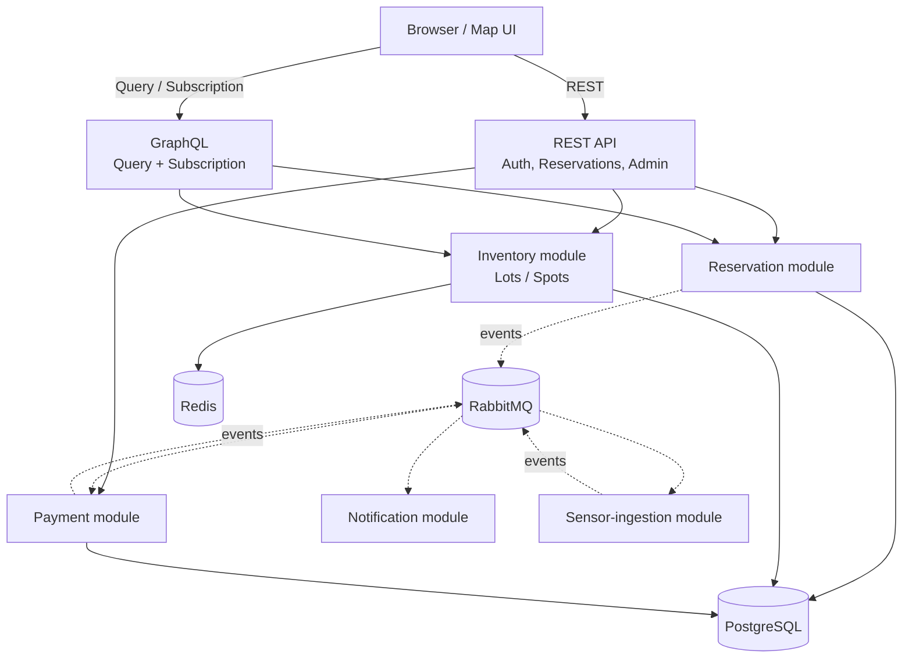

# ParkFlow

[](https://github.com/rostikdiv/parkflow/actions/workflows/ci.yml)

Система бронювання паркомісць з live-мапою: клієнт бачить паркінги на карті, вільні місця в реальному часі, і може забронювати конкретне місце на часовий діапазон.

## 🚀 Live Demo
*(Буде додано після розгортання)*

## 🛠️ Tech Stack
- **Java 21**, **Spring Boot 3.4**
- **PostgreSQL**, **Redis**, **RabbitMQ**
- **Testcontainers** (з `.withReuse(true)`)

## 🏗️ Architecture


## 🧪 Problems I Deliberately Solved
1. Race condition on booking — драбина рішень
2. Idempotency на подвійний сабміт
3. Sealed classes + exhaustive switch
4. CQRS-lite: REST для команд, GraphQL для запитів/подій
5. Graceful degradation при падінні RabbitMQ/Postgres/сенсора

## 📊 Benchmarks
*(В процесі...)*

## 🔧 Troubleshooting

### Testcontainers
Щоб тести працювали швидше завдяки перевикористанню контейнерів (reuse), переконайтеся, що у вас налаштовано:
1. Файл `~/.testcontainers.properties` у домашній директорії.
2. Вміст файлу:
   ```properties
   testcontainers.reuse.enable=true
   ```

## 🗺️ Consciously Deferred
- PostGIS, Kubernetes, реальний платіжний провайдер, повноцінний React SPA

## 📄 License
MIT
