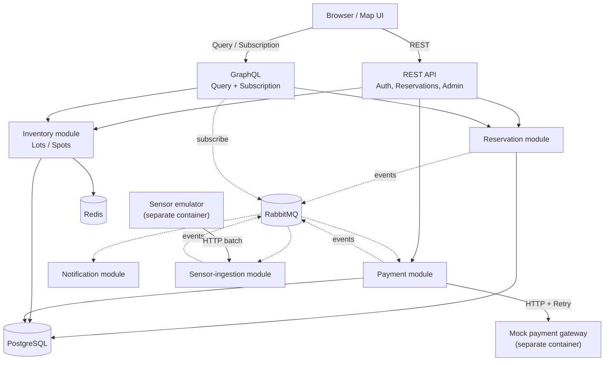

# ParkFlow — technical implementation plan

Parking space reservation system with live map: the client sees parking lots on the map, free spaces in real time (data from simulated physical sensors), and can book a specific space for a time range.

---

## 1. System description

Three independent sources of input data form the architecture:

1. **Client REST/GraphQL API** (synchronous) — search for free spaces, create/cancel reservation, view status.
2. **Sensor event stream** (asynchronous, high-frequency, simulated by a separate `sensor-emulator` container) — sends `{spotId, status: OCCUPIED|FREE, timestamp}` batches to the internal ingestion endpoint every few seconds.
3. **Outside system calls** (payment gateway, notifications) — simulated by a separate mock service with "chaos" mode (controlled % of failures/timeouts for fair demonstration of Retry).

Booking flow: client books a place (REST) ​​→ payment confirmation task in queue → worker calls payment gateway (with Retry) → booking status is updated → "confirmed" event in notification queue → separate worker sends notification. In parallel, the event stream from sensors continuously updates the physical state of places and checks with reservations (reconciliation), detecting discrepancies without any ML — pure deterministic business rules on time windows.

---

## 2. Technology stack

| Layer | Technology |
|---|---|
| Language/platform | Java 21 (Virtual Threads, Sealed Classes, Sequenced Collections) |
| Framework | Spring Boot 3.x |
| API | Spring MVC (REST) ​​+ Spring GraphQL |
| Persistence | PostgreSQL + Spring Data JPA/Hibernate + Flyway (migrations) |
| Concurrency control | PostgreSQL exclusion constraint (production level), `@Version`/`ReentrantLock` (learning examples shown in README as a solution ladder) |
| Queue/Events | RabbitMQ |
| Cache | Redis |
| Resilience | Resilience4j — Retry, Circuit Breaker, RateLimiter (one tool, three patterns) |
| HTTP client | `java.net.http.HttpClient` (built-in) |
| Validation/Parsing | `Pattern`/`Matcher` (license plates, sensor payload) |
| State modeling | `sealed interface ReservationStatus` + exhaustive `switch` (record patterns) |
| Observability | Spring Boot Actuator, Prometheus/Grafana, Micrometer Tracing + Zipkin |
| Testing | JUnit 5, Mockito, `@WebMvcTest`/`@DataJpaTest`, Testcontainers (Postgres + RabbitMQ) |
| Frontend (MVP) | Vanilla JS + Leaflet + OpenStreetMap tiles |
| Frontend (optional upgrade) | React (Vite) + react-leaflet + GraphQL Subscription |
| DevOps | Docker + Docker Compose, GitHub Actions CI, Terraform (GCP: Cloud Run/GKE, Cloud SQL, Memorystore, RabbitMQ — self-hosted on Compute Engine or CloudAMQP marketplace) |

**Cloud note:** orthoeye.digital and TJHelpers mention AWS in their job postings. Conscious choice of GCP instead of AWS is an honest compromise: Terraform, VPC, managed Postgres/Redis, CI/CD and the IaC approach itself are transferred between clouds almost 1-in-1 (same thinking model, different service names), so in the interview this is a governance question "do you know IaC/cloud at all", not "do you know the AWS console specifically". One line in the README is worth it: "Built on GCP; concepts transfer directly to AWS/Azure — Terraform, IAM, managed services."

---

## 3. Architecture: modular monolith

One deployed Spring Boot application, divided into domain modules (`reservation`, `inventory`, `payment`, `notification`, `sensor-ingestion`), each with clear boundaries: communication between modules — only through explicit interfaces or events in RabbitMQ, never directly through other people's repositories. RabbitMQ acts as an internal event bus — the same loose coupling as in a microservice architecture, without the operational complexity of separate deployments.

Each module internally has the same layered structure: **API layer** (controllers/GraphQL resolvers, DTOs) → **Application layer** (use-case services, orchestration) → **Domain layer** (entities, domain events, business rules) → **Infrastructure layer** (JPA repositories, RabbitMQ publishers, HTTP clients), with dependency inversion: Infrastructure implements interfaces declared in Domain, not vice versa.

### Components and technologies



---

## 4. Domain Model

### 4.1 Entities

**ParkingLot** — `id, name, address, latitude/longitude (bbox-search), type: OPEN_AIR|INDOOR|UNDERGROUND, hourlyRate, opensAt/closesAt, timeZone, status: ACTIVE|CLOSED` (soft delete — the parking lot is not deleted, but closed)

**Spot** — `id, parkingLot, code ("A-12"), type: STANDARD|DISABLED|EV_CHARGING|COMPACT, physicalStatus: FREE|OCCUPIED|UNKNOWN (status from the sensor), lastSensorUpdate, version (@Version), layoutX/layoutY (position on the diagram for rendering)`

**AppUser** — `id, email (unique), passwordHash, fullName, phone, role: USER|ADMIN, deletedAt` (soft delete)

**Reservation** — `id, user, spot, licensePlate (regex-validation), startTime/endTime (separate columns of type timestamptz — Hibernate does not have a built-in mapping to tstzrange, it is not worth fighting with this through additional types on MVP), status (enum in the database → sealed type in the domain), totalPrice, idempotencyKey (unique, required header, 400 if missing), createdAt/updatedAt`

**Payment** — `id, reservation (OneToOne), amount, status: INITIATED|SUCCEEDED|FAILED|REFUNDED, externalRef, attempts, lastError`

**SensorEvent** (append-only) — `id, externalEventId (unique — idempotency of repeated delivery from the emulator), spotId, rawPayload, status, sensorTimestamp, receivedAt, processedAt`

**SpotAnomaly** — `id, spot, type: OCCUPIED_WITHOUT_RESERVATION|RESERVED_BUT_EMPTY_TOO_LONG|SENSOR_SILENT, details, detectedAt, resolvedAt`

**ReservationAudit** (append-only log of each status transition):
```sql
CREATE TABLE reservation_audit (
id UUID PRIMARY KEY,
reservation_id UUID NOT NULL,
from_status VARCHAR,
to_status VARCHAR,
triggered_by VARCHAR, -- USER | SYSTEM | SENSOR | PAYMENT
metadata JSONB,
created_at TIMESTAMPTZ DEFAULT NOW()
);
```
Written directly in the use-case service at each `ReservationStatus` transition. Another legitimate use of `JSONB` (argument for Testcontainers — H2 won't pull).

### 4.2 Sealed status hierarchy

```java
public sealed interface ReservationStatus { 
record Pending(Instant createdAt) implements ReservationStatus {} 
record Confirmed(Instant confirmedAt, String paymentRef) implements ReservationStatus {} 
record Active(Instant checkedInAt) implements ReservationStatus {} 
record Completed(Instant completedAt) implements ReservationStatus {} 
record Expired(String reason) implements ReservationStatus {} 
record Canceled(String canceledBy, Instant at) implements ReservationStatus {}
}
```

Transitions — exclusively through exhaustive `switch` with record patterns:
```java
static ReservationStatus onPaymentSuccess(ReservationStatus s, String ref) { 
return switch (s) { 
case Pending p -> new Confirmed(Instant.now(), ref); 
case Confirmed c -> throw new IllegalStateException("already confirmed"); 
case Active a -> throw new IllegalStateException("already active"); 
case Completed c -> throw new IllegalStateException("finished"); 
case Expired e -> throw new IllegalStateException("expired"); 
case Canceled c -> throw new IllegalStateException("cancelled"); 
};
}
```

**Note on mapping:** JPA does not map sealed hierarchies directly. Solution: in the DB — a regular enum column, sealed types are reconstructed in the domain layer by the mapper (the same exhaustive switch). "DB stores the fact, the domain models the behavior" — a conscious architectural decision, not a crutch.

### 4.3 Race condition on reservations — a ladder of solutions

`@Version` on Spot is too crude — serializes all seat reservations, even those that are not overlapping in time. Therefore, three levels, all shown in the code as a learning progression:

| Level | Mechanism | Status |
|---|---|---|
| 1. Learning | `ReentrantLock` per spotId (`ConcurrentHashMap<String, ReentrantLock>`) | shows low-level concurrency, does not scale to >1 instance |
| 2. Basic | `@Version` optimistic locking | works, but too crude for time-range |
| 3. Production | `EXCLUDE USING gist (spot_id WITH =, tstzrange(start_time, end_time) WITH &&)` | atomic rejection of intersection intervals at the DB level, scales to any number of instances |

Test that proves this: 50 threads via `ExecutorService` simultaneously booking one spot at the same time → exactly one success, 49 → `ConflictException`.

**Caution on Virtual Threads:** this is why level 1 of the training ladder uses `ReentrantLock`, not `synchronized` — `synchronized` blocks can pin a virtual thread to a platform carrier thread in Java 21, which negates the benefit of Virtual Threads. `ReentrantLock` does not cause pinning.

### 4.4 Flyway migration order — `btree_gist` before exclusion constraint

`EXCLUDE USING gist` on `spot_id` (type `uuid`) requires `btree_gist` extension — "pure" GiST in PostgreSQL does not support equality operator for `uuid`/`int` without it. The extension must be promoted **to** the table with exclusion constraint, otherwise migration will fail:

```sql
-- V1__extensions.sql
CREATE EXTENSION IF NOT EXISTS btree_gist;

-- later migration (M2) can already declare EXCLUDE USING gist
```

---

## 5. Idempotency-Key

```
Client generates Idempotency-Key (UUIDv4) →
Redis: SET idempotency:{key} "processing" EX 300 NX
→ SET successful → continue creating reservation
→ key already exists → 409 Conflict with reference to existing reservation
After transaction completion → SET idempotency:{key} {reservationId} EX 86400
```

**Why Redis and unique `idempotencyKey` in the DB:** Redis `SETNX` — fast fail-fast for requests that came almost simultaneously (races before the DB transaction even started). Unique constraint in Postgres — durable fallback level: if Redis crashes or TTL works incorrectly, the DB still will not miss the duplicate. The two layers are intentional, not excessive.
---

## 6. Graceful Degradation

| Сценарій | Поведінка системи |
|---|---|
| RabbitMQ недоступний | Мапа показує останній відомий стан з Redis (TTL 5 хв) + бейдж "дані можуть бути застарілими" |
| PostgreSQL недоступний | `503` + `Retry-After: 5` |
| Sensor-emulator зупинився | `Spot.lastSensorUpdate > 10 хв` → маркер сірий, `physicalStatus = UNKNOWN` (той самий механізм, що й `SpotAnomaly.SENSOR_SILENT`) |

---

## 7. REST API (v1)

**Auth:** `POST /api/v1/auth/register` · `POST /api/v1/auth/login` (JWT)

**Мапа та пошук (публічні, з RateLimiter):**
- `GET /api/v1/parking-lots?bbox=minLng,minLat,maxLng,maxLat`
- `GET /api/v1/parking-lots/{id}`
- `GET /api/v1/parking-lots/geojson`
- `GET /api/v1/parking-lots/{id}/availability?from=&to=` (через Redis-кеш)
- `GET /api/v1/spots/{id}`

**Бронювання (авторизовані, `Idempotency-Key` header обов'язковий на POST):**
- `POST /api/v1/reservations` — `{spotId, from, to, licensePlate}`
- `GET /api/v1/reservations/my?status=`
- `GET /api/v1/reservations/{id}`
- `DELETE /api/v1/reservations/{id}`

`Idempotency-Key` документується в SpringDoc/OpenAPI як `required = true`; відсутність заголовка → `400 Bad Request` на рівні валідації контролера, ще до бізнес-логіки. CORS для першого браузерного клієнта (vanilla JS з M3.5) конфігурується через `WebMvcConfigurer` — дозволений origin статичної сторінки.

**Internal (API-ключ, не JWT):**
- `POST /api/internal/v1/sensor-events` — batch від емулятора

**Admin:**
- `GET /api/admin/v1/anomalies?resolved=false`
- `POST /api/admin/v1/anomalies/{id}/resolve`

**Інфраструктура:** `/actuator/health`, `/actuator/prometheus`. Помилки — RFC 7807 `ProblemDetail`.

---

## 8. GraphQL — тільки Query + Subscription (CQRS-lite)

Створення й скасування бронювання йдуть виключно через REST. GraphQL відповідає за складні читання (структура мапи) і real-time потік — це усуває дублювання бізнес-логіки у двох транспортних шарах:

```graphql
type Query {
  parkingLots(bbox: BboxInput): [ParkingLot!]!
  parkingLot(id: ID!): ParkingLot
  availability(lotId: ID!, from: Instant!, to: Instant!): [SpotAvailability!]!
  myReservations(status: ReservationStatusType): [Reservation!]!
}

type Subscription {
spotStatusChanged(lotId: ID!): SpotStatusEvent!
}

type SpotStatusEvent { spotId: ID!, status: PhysicalStatus!, at: Instant! }
```

`Subscription` subscribes to the same `spot.status.changed` event that `sensor-ingestion` publishes to RabbitMQ — the internal event becomes a public stream through a single listener.

**Transport:** Subscription works over WebSocket (`spring.graphql.websocket.path=/graphql-ws`), a separate channel from the regular HTTP GraphQL endpoint for Query — the frontend (M7) connects to it with a separate WS-client.

---

## 9. RabbitMQ topology

| Exchange | Type | Routing key | Queue → Consumer |
|---|---|---|---|
| `parkflow.sensor` | topic | `sensor.{lotId}` | `q.sensor.events` → ingestion consumer (batch ack, idempotence by sensor event id) |
| `parkflow.payment` | direct | `payment.command` / `payment.result` | `q.payment.commands` → payment-worker · `q.payment.results` → reservation module |
| `parkflow.notification` | direct | `notify.{email,push}` | `q.notification.commands` → notification-worker |
| `parkflow.dlx` | direct | — | `*.dlq` — dead-letter for all queues + alert |

**Virtual Threads for consumers require explicit configuration.** `spring.threads.virtual.enabled=true` enables Virtual Threads for the web container (Tomcat), but **not** for the RabbitMQ listener — it has its own thread pool. Explicitly connect `Executors.newVirtualThreadPerTaskExecutor()` as `taskExecutor` in `SimpleRabbitListenerContainerFactory`. Consumer idempotence: `processed_events` (Postgres unique) or Redis `SETNX`.

**Dead-letter configuration:** each work queue (`q.sensor.events`, `q.payment.commands`, `q.notification.commands`) is declared with the argument `x-dead-letter-exchange: parkflow.dlx` — without this, a message that has exhausted retries is lost, and does not get into `*.dlq`.

---

## 10. Reconciliation

`@Scheduled` job (every 2–5 min), for each Spot compares the latest `SensorEvent` with the active `Reservation`:

| Anomaly | Condition | Reaction |
|---|---|---|
| `OCCUPIED_WITHOUT_RESERVATION` | sensor OCCUPIED, no active reservation | `SpotAnomaly` + admin-notification |
| `RESERVED_BUT_EMPTY_TOO_LONG` | reservation active, sensor FREE longer grace-period (15 min) | no-show: anomaly + optional auto-expire |
| `SENSOR_SILENT` | no events > X min | anomaly, status → `UNKNOWN`, gray marker |

---

## 11. Redis caching

- `availability:{lotId}:{from}:{to}` → TTL 30–60s + active invalidation by `reservation.created/cancelled`, `spot.status.changed` events (cache-aside)
- `lots:geojson` → TTL + invalidation on CRUD of lots
- Load test (k6/JMeter) before/after cache → latency graph in README

---

## 12. Resilience (payment gateway)

- **Mock gateway:** separate Spring Boot application/profile with chaos-config (managed % 500/timeout).
- **Resilience4j:** Retry (exponential backoff 200ms×2, max 5 attempts) → Circuit Breaker (sliding window 10, threshold 50%) → TimeLimiter. Calls via `HttpClient`.
- **RateLimiter** — the same module, on public bbox-search.
- **Idempotency-Key** is passed to the gateway — retry is safe.
- **Compensation:** retry exhaustion → `Payment.FAILED` → event → `Reservation.Expired("payment_failed")` → place is freed.

---

## 13. Observability

- Actuator + Prometheus (`/actuator/prometheus`) + Grafana dashboards (CPU, memory, latency).
- Micrometer Tracing + Zipkin — traceId passes through REST controller → publication in RabbitMQ → consumer on Virtual Thread → payment gateway call. Technically more difficult task than tracing between synchronous services — context propagation via message broker, not via HTTP headers.
---

## 14. Testing strategy — two phases

### Phase A: tests for the backbone (with M0, in parallel with writing the structure)

The goal is to have the test infrastructure ready before complex business logic appears, so that M2-M3 (race conditions, queues) can be developed immediately with a reliable base:

- Basic configuration of Testcontainers (Postgres + RabbitMQ) via `@ServiceConnection` (Spring Boot 3.1+ — itself waits for the container to be ready, eliminates the typical problem "RabbitMQ connection refused" when the connection is triggered before the container has been started). Containers — **singleton/reuse for the entire testsuite** (`.withReuse(true)` + `testcontainers.reuse.enable=true` in `~/.testcontainers.properties`), otherwise each test class starts the container for 30+ seconds.
- Smoke test: the Spring context starts, the containers start, `/actuator/health` returns `UP`.
- Contract tests for the REST endpoint skeleton (`@WebMvcTest`) — correct HTTP statuses and response form even before filling with business logic (TDD style: first contract, then implementation).
- Repository tests (`@DataJpaTest` + Testcontainers) for newly generated Flyway migrations — checking that the database schema is correct even before the business logic above it.

### Phase B: tests for ready functionality (as each milestone is completed)

- **M2 (reservation):** race test of 50 threads through `ExecutorService`, test for exhaustive `switch` of status transitions (all branches), idempotency test (two identical requests → one result + 409 on the second), check of the entry in `ReservationAudit`.
- **M3 (asynchrony):** integration test "event in queue → consumer processed → record in DB" (Testcontainers RabbitMQ), consumer idempotence test (redelivery does not duplicate a record).
- **M4 (reconciliation):** tests of each `SpotAnomaly` type separately, graceful degradation test (RabbitMQ/Postgres are not available — mocked via Testcontainers `stop()`).
- **M5 (resilience):** Circuit Breaker test (chaos-mode of mock-gateway enables 100% failures → coil opens), Retry test (first attempt fails, second successful), RateLimiter test (limit exceeded → 429).
- **M6 (GraphQL):** Query resolver tests, Subscription test (event publication → subscriber receives).
- **M8 (security):** JWT tests (valid/expired/fake token), role-based access tests (USER cannot call admin endpoints), license plate regex validation test.

This separation means that no milestone is left without test coverage "for later" - phase A guarantees the infrastructure from day one, phase B is added organically with each new functionality, and not one big "write tests" milestone at the end.

---

## 15. Milestones

| # | Milestone | Table of Contents |
|---|---|---|
| M0 | Foundation | Repo, Spring Boot 3/Java 21, docker-compose (Postgres+Redis+RabbitMQ), Flyway, GitHub Actions skeleton, basic Testcontainers configuration (Phase A tests) |
| M1 | Domain + CRUD | Entities, migrations (`V1__extensions.sql` with `btree_gist` — in advance, before the exclusion constraint in M2), REST lots/spots, seed data (3 lots × ~40 spots), repository tests |
| M2 | Reservation | Exclusion constraint, idempotency-key, cancel, race test 50 threads, sealed-statuses, ReservationAudit |
| M3 | Asynchrony | RabbitMQ-topology (with DLX-arguments), sensor-emulator as **separate module with its own Dockerfile from the very beginning** (not refactoring with `@Scheduled` later), ingestion + consumer with explicit virtual-thread executor |
| M3.5 | Early visual demo | Vanilla JS + Leaflet, static page, live tokens (polling or simple WebSocket), CORS-configuration for the first browser client |
| M4 | Reconciliation | Sensor↔Armor Reconciliation, SpotAnomaly, Admin Endpoints, Graceful Degradation |
| M5 | Payments + Notifications | Mock-gateway with chaos mode, Resilience4j (Retry/Circuit Breaker/RateLimiter), notification-worker (MailHog) |
| M6 | GraphQL + Redis | Query+Subscription schema, availability cache, benchmark before/after |
| M7 | Frontend polishing (optional) | Upgrade to React + react-leaflet + GraphQL Subscription |
| M8 | Security + Quality | JWT, Roles, RFC 7807 ProblemDetail, Regex Validation |
| M9a | DevOps: Infrastructure | Terraform modules (`vpc`, `cloud-run` or `gke`, `cloud-sql` — PostgreSQL, `memorystore` — Redis, `rabbitmq` — Compute Engine VM or CloudAMQP, `load-balancer`), `environments/dev`+`prod`, `terraform plan` in CI, domain+HTTPS |
| M9b | DevOps: observability + demo | Prometheus/Grafana, Zipkin-trace through queue, k6 load-test, README, demo-GIF |

Each milestone — separate PR and git tag (`v0.1`…`v1.0`).

**Note on CI for Terraform:** `terraform fmt -check` + `terraform plan` as a separate job in GitHub Actions is added in the same PR as the first Terraform modules, i.e. in **M9a**, and not beforehand in M0 — before this point, the Terraform code does not yet exist in the repository, and the job simply will not check anything.

---

## 16. README Template

```markdown
# ParkFlow

## 🚀 Live Demo

## 🛠️ Tech Stack
## 🏗️ Architecture
[Mermaid Component Diagram]

## 🧪 Problems I Deliberately Solved
1. Race condition on booking — solution ladder
2. Idempotency on double submit
3. Sealed classes + exhaustive switch
4. CQRS-lite: REST for commands, GraphQL for queries/events
5. Graceful degradation when RabbitMQ/Postgres/sensor crashes

## 📊 Benchmarks
## 🔧 Troubleshooting
## 🗺️ Consciously Deferred
- PostGIS, Kubernetes, real payment provider, full React SPA
## 📄 License
```

---

## 17. Consciously Deferred / Out of Scope

- **PostGIS** — bbox on lat/lng is enough for MVP.
- **Kubernetes.**
- **Real payment providers** — only mock with chaos mode.
- **Full React SPA with all screens** — optional M7; vanilla JS with M3.5 — acceptable final frontend.
- **Chaos engineering outside the payment gateway** (slow query, memory pressure, network partition) — bonus README section, not a separate milestone.