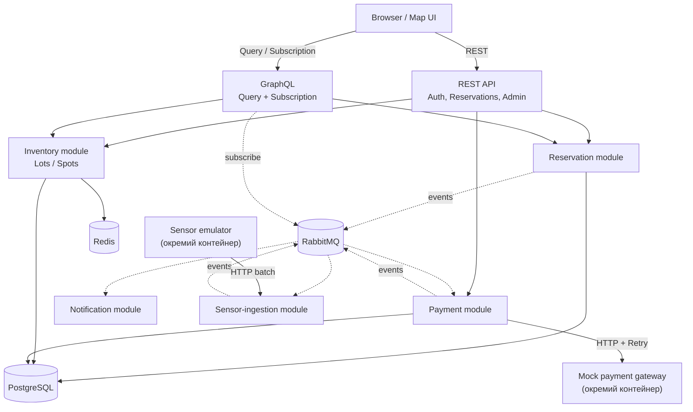

# ParkFlow — технічний план реалізації

Система бронювання паркомісць з live-мапою: клієнт бачить паркінги на карті, вільні місця в реальному часі (дані від симульованих фізичних сенсорів), і може забронювати конкретне місце на часовий діапазон.

---

## 1. Опис системи

Три незалежні джерела вхідних даних формують архітектуру:

1. **Клієнтський REST/GraphQL API** (синхронний) — пошук вільних місць, створення/скасування бронювання, перегляд статусу.
2. **Потік подій від сенсорів** (асинхронний, високочастотний, симульований окремим контейнером `sensor-emulator`) — кожні кілька секунд шле `{spotId, status: OCCUPIED|FREE, timestamp}` batch-ами на internal ingestion-ендпоінт.
3. **Виклики системи назовні** (платіжний шлюз, сповіщення) — симульовані окремим mock-сервісом з "chaos"-режимом (керований % відмов/timeout-ів для чесної демонстрації Retry).

Потік бронювання: клієнт бронює місце (REST) → задача підтвердження оплати в чергу → воркер викликає платіжний шлюз (з Retry) → статус бронювання оновлюється → подія "підтверджено" в чергу сповіщень → окремий воркер шле нотифікацію. Паралельно потік подій від сенсорів безперервно оновлює фізичний стан місць і звіряється з бронюваннями (reconciliation), виявляючи розбіжності без жодного ML — чисті детерміновані бізнес-правила на часових вікнах.

---

## 2. Технологічний стек

| Шар | Технологія |
|---|---|
| Мова/платформа | Java 21 (Virtual Threads, Sealed Classes, Sequenced Collections) |
| Framework | Spring Boot 3.x |
| API | Spring MVC (REST) + Spring GraphQL |
| Персистентність | PostgreSQL + Spring Data JPA/Hibernate + Flyway (міграції) |
| Concurrency-контроль | PostgreSQL exclusion constraint (продакшн-рівень), `@Version`/`ReentrantLock` (навчальні приклади, показані в README як драбина рішень) |
| Черга/події | RabbitMQ |
| Кеш | Redis |
| Resilience | Resilience4j — Retry, Circuit Breaker, RateLimiter (один інструмент, три патерни) |
| HTTP-клієнт | `java.net.http.HttpClient` (вбудований) |
| Валідація/парсинг | `Pattern`/`Matcher` (номерні знаки, sensor payload) |
| Моделювання станів | `sealed interface ReservationStatus` + exhaustive `switch` (record patterns) |
| Спостережуваність | Spring Boot Actuator, Prometheus/Grafana, Micrometer Tracing + Zipkin |
| Тестування | JUnit 5, Mockito, `@WebMvcTest`/`@DataJpaTest`, Testcontainers (Postgres + RabbitMQ) |
| Фронтенд (MVP) | Vanilla JS + Leaflet + OpenStreetMap тайли |
| Фронтенд (опційний апгрейд) | React (Vite) + react-leaflet + GraphQL Subscription |
| DevOps | Docker + Docker Compose, GitHub Actions CI, Terraform (GCP: Cloud Run/GKE, Cloud SQL, Memorystore, RabbitMQ — self-hosted на Compute Engine або CloudAMQP marketplace) |

**Примітка щодо хмари:** orthoeye.digital і TJHelpers у вакансіях згадують саме AWS. Свідомий вибір GCP замість AWS — чесно позначений компроміс: Terraform, VPC, managed Postgres/Redis, CI/CD і сам підхід до IaC переносяться між хмарами майже 1-в-1 (та сама модель мислення, інші назви сервісів), тому на співбесіді це governance-питання "чи вмієш ти взагалі в IaC/cloud", а не "чи знаєш ти конкретно AWS-консоль". Вартий один рядок в README: "Built on GCP; concepts transfer directly to AWS/Azure — Terraform, IAM, managed services."

---

## 3. Архітектура: модульний моноліт

Один деплойований Spring Boot застосунок, розділений на доменні модулі (`reservation`, `inventory`, `payment`, `notification`, `sensor-ingestion`), кожен з чіткими межами: спілкування між модулями — тільки через явні інтерфейси або події в RabbitMQ, ніколи напряму через чужі репозиторії. RabbitMQ виступає внутрішнім event bus — та сама асинхронна розв'язка (loose coupling), що й у мікросервісній архітектурі, без операційної складності окремих деплойментів.

Кожен модуль всередині має однакову шарувату структуру: **API-шар** (контролери/GraphQL-резолвери, DTO) → **Application-шар** (use-case сервіси, оркестрація) → **Domain-шар** (сутності, доменні події, бізнес-правила) → **Infrastructure-шар** (JPA-репозиторії, RabbitMQ-паблішери, HTTP-клієнти), з інверсією залежностей: Infrastructure реалізує інтерфейси, оголошені в Domain, а не навпаки.

### Компоненти і технології



---

## 4. Доменна модель

### 4.1 Сутності

**ParkingLot** — `id, name, address, latitude/longitude (bbox-пошук), type: OPEN_AIR|INDOOR|UNDERGROUND, hourlyRate, opensAt/closesAt, timeZone, status: ACTIVE|CLOSED` (soft delete — паркінг не видаляється, а закривається)

**Spot** — `id, parkingLot, code ("A-12"), type: STANDARD|DISABLED|EV_CHARGING|COMPACT, physicalStatus: FREE|OCCUPIED|UNKNOWN (стан від сенсора), lastSensorUpdate, version (@Version), layoutX/layoutY (позиція на схемі для рендерингу)`

**AppUser** — `id, email (unique), passwordHash, fullName, phone, role: USER|ADMIN, deletedAt` (soft delete)

**Reservation** — `id, user, spot, licensePlate (regex-валідація), startTime/endTime (окремі колонки типу timestamptz — Hibernate не має вбудованого мапінгу на tstzrange, боротись із цим через додаткові типи на MVP не варто), status (enum у БД → sealed тип у домені), totalPrice, idempotencyKey (unique, required header, 400 якщо відсутній), createdAt/updatedAt`

**Payment** — `id, reservation (OneToOne), amount, status: INITIATED|SUCCEEDED|FAILED|REFUNDED, externalRef, attempts, lastError`

**SensorEvent** (append-only) — `id, externalEventId (unique — ідемпотентність повторної доставки від емулятора), spotId, rawPayload, status, sensorTimestamp, receivedAt, processedAt`

**SpotAnomaly** — `id, spot, type: OCCUPIED_WITHOUT_RESERVATION|RESERVED_BUT_EMPTY_TOO_LONG|SENSOR_SILENT, details, detectedAt, resolvedAt`

**ReservationAudit** (append-only лог кожного переходу статусу):
```sql
CREATE TABLE reservation_audit (
    id UUID PRIMARY KEY,
    reservation_id UUID NOT NULL,
    from_status VARCHAR,
    to_status VARCHAR,
    triggered_by VARCHAR, -- USER | SYSTEM | SENSOR | PAYMENT
    metadata JSONB,
    created_at TIMESTAMPTZ DEFAULT NOW()
);
```
Пишеться прямо в use-case сервісі при кожному переході `ReservationStatus`. Ще одне легітимне використання `JSONB` (аргумент для Testcontainers — H2 не потягне).

### 4.2 Sealed-ієрархія статусів

```java
public sealed interface ReservationStatus {
    record Pending(Instant createdAt) implements ReservationStatus {}
    record Confirmed(Instant confirmedAt, String paymentRef) implements ReservationStatus {}
    record Active(Instant checkedInAt) implements ReservationStatus {}
    record Completed(Instant completedAt) implements ReservationStatus {}
    record Expired(String reason) implements ReservationStatus {}
    record Cancelled(String cancelledBy, Instant at) implements ReservationStatus {}
}
```

Переходи — виключно через exhaustive `switch` з record patterns:
```java
static ReservationStatus onPaymentSuccess(ReservationStatus s, String ref) {
    return switch (s) {
        case Pending p   -> new Confirmed(Instant.now(), ref);
        case Confirmed c -> throw new IllegalStateException("already confirmed");
        case Active a    -> throw new IllegalStateException("already active");
        case Completed c -> throw new IllegalStateException("finished");
        case Expired e   -> throw new IllegalStateException("expired");
        case Cancelled c -> throw new IllegalStateException("cancelled");
    };
}
```

**Примітка щодо мапінгу:** JPA погано мапить sealed-ієрархії напряму. Рішення: в БД — звичайний enum-стовпець, sealed-типи реконструюються в доменному шарі мапером (той самий exhaustive switch). "БД зберігає факт, домен моделює поведінку" — свідоме архітектурне рішення, а не костиль.

### 4.3 Race condition на бронюванні — драбина рішень

`@Version` на Spot надто грубий — серіалізує всі бронювання місця, навіть неперетинні за часом. Тому три рівні, всі показані в коді як навчальна прогресія:

| Рівень | Механізм | Статус |
|---|---|---|
| 1. Навчальний | `ReentrantLock` per spotId (`ConcurrentHashMap<String, ReentrantLock>`) | показує low-level concurrency, не масштабується на >1 інстанс |
| 2. Базовий | `@Version` optimistic locking | працює, але надто грубо для time-range |
| 3. Продакшн | `EXCLUDE USING gist (spot_id WITH =, tstzrange(start_time, end_time) WITH &&)` | атомарне відхилення перетинних інтервалів на рівні БД, масштабується на будь-яку кількість інстансів |

Тест, що це доводить: 50 потоків через `ExecutorService` одночасно бронюють одне місце на один час → рівно один успіх, 49 → `ConflictException`.

**Застереження щодо Virtual Threads:** саме тому рівень 1 навчальної драбини використовує `ReentrantLock`, а не `synchronized` — `synchronized`-блоки можуть "пінити" (pin) віртуальний потік до платформного carrier-потоку в Java 21, що нівелює вигоду від Virtual Threads. `ReentrantLock` пінінгу не спричиняє.

### 4.4 Порядок Flyway-міграцій — `btree_gist` перед exclusion constraint

`EXCLUDE USING gist` на `spot_id` (тип `uuid`) вимагає розширення `btree_gist` — "чистий" GiST у PostgreSQL не підтримує оператор рівності для `uuid`/`int` без нього. Розширення має піднятись **до** таблиці з exclusion constraint, інакше міграція впаде:

```sql
-- V1__extensions.sql
CREATE EXTENSION IF NOT EXISTS btree_gist;

-- пізніша міграція (M2) вже може оголошувати EXCLUDE USING gist
```

---

## 5. Idempotency-Key

```
Клієнт генерує Idempotency-Key (UUIDv4) →
  Redis: SET idempotency:{key} "processing" EX 300 NX
    → SET успішний → продовжуємо створення броні
    → ключ вже існує → 409 Conflict з посиланням на існуюче бронювання
  Після завершення транзакції → SET idempotency:{key} {reservationId} EX 86400
```

**Навіщо і Redis, і унікальний `idempotencyKey` у БД:** Redis `SETNX` — швидкий fail-fast для запитів, що прийшли майже одночасно (races до того, як транзакція БД взагалі почалась). Унікальний constraint у Postgres — durable запасний рівень: якщо Redis впаде або TTL некоректно спрацює, БД все одно не пропустить дублікат. Два шари навмисні, не надлишкові.

---

## 6. Graceful Degradation

| Сценарій | Поведінка системи |
|---|---|
| RabbitMQ недоступний | Мапа показує останній відомий стан з Redis (TTL 5 хв) + бейдж "дані можуть бути застарілими" |
| PostgreSQL недоступний | `503` + `Retry-After: 5` |
| Sensor-emulator зупинився | `Spot.lastSensorUpdate > 10 хв` → маркер сірий, `physicalStatus = UNKNOWN` (той самий механізм, що й `SpotAnomaly.SENSOR_SILENT`) |

---

## 7. REST API (v1)

**Auth:** `POST /api/v1/auth/register` · `POST /api/v1/auth/login` (JWT)

**Мапа та пошук (публічні, з RateLimiter):**
- `GET /api/v1/parking-lots?bbox=minLng,minLat,maxLng,maxLat`
- `GET /api/v1/parking-lots/{id}`
- `GET /api/v1/parking-lots/geojson`
- `GET /api/v1/parking-lots/{id}/availability?from=&to=` (через Redis-кеш)
- `GET /api/v1/spots/{id}`

**Бронювання (авторизовані, `Idempotency-Key` header обов'язковий на POST):**
- `POST /api/v1/reservations` — `{spotId, from, to, licensePlate}`
- `GET /api/v1/reservations/my?status=`
- `GET /api/v1/reservations/{id}`
- `DELETE /api/v1/reservations/{id}`

`Idempotency-Key` документується в SpringDoc/OpenAPI як `required = true`; відсутність заголовка → `400 Bad Request` на рівні валідації контролера, ще до бізнес-логіки. CORS для першого браузерного клієнта (vanilla JS з M3.5) конфігурується через `WebMvcConfigurer` — дозволений origin статичної сторінки.

**Internal (API-ключ, не JWT):**
- `POST /api/internal/v1/sensor-events` — batch від емулятора

**Admin:**
- `GET /api/admin/v1/anomalies?resolved=false`
- `POST /api/admin/v1/anomalies/{id}/resolve`

**Інфраструктура:** `/actuator/health`, `/actuator/prometheus`. Помилки — RFC 7807 `ProblemDetail`.

---

## 8. GraphQL — тільки Query + Subscription (CQRS-lite)

Створення й скасування бронювання йдуть виключно через REST. GraphQL відповідає за складні читання (структура мапи) і real-time потік — це усуває дублювання бізнес-логіки у двох транспортних шарах:

```graphql
type Query {
  parkingLots(bbox: BboxInput): [ParkingLot!]!
  parkingLot(id: ID!): ParkingLot
  availability(lotId: ID!, from: Instant!, to: Instant!): [SpotAvailability!]!
  myReservations(status: ReservationStatusType): [Reservation!]!
}

type Subscription {
  spotStatusChanged(lotId: ID!): SpotStatusEvent!
}

type SpotStatusEvent { spotId: ID!, status: PhysicalStatus!, at: Instant! }
```

`Subscription` підписується на ту саму подію `spot.status.changed`, яку публікує `sensor-ingestion` у RabbitMQ — внутрішня подія стає публічним стрімом через один listener.

**Транспорт:** Subscription працює через WebSocket (`spring.graphql.websocket.path=/graphql-ws`), окремий канал від звичайного HTTP GraphQL-ендпоінта для Query — фронтенд (M7) підключається до нього окремим WS-клієнтом.

---

## 9. Топологія RabbitMQ

| Exchange | Тип | Routing key | Черга → Consumer |
|---|---|---|---|
| `parkflow.sensor` | topic | `sensor.{lotId}` | `q.sensor.events` → ingestion consumer (batch ack, ідемпотентність за sensor event id) |
| `parkflow.payment` | direct | `payment.command` / `payment.result` | `q.payment.commands` → payment-worker · `q.payment.results` → reservation модуль |
| `parkflow.notification` | direct | `notify.{email,push}` | `q.notification.commands` → notification-worker |
| `parkflow.dlx` | direct | — | `*.dlq` — dead-letter для всіх черг + алерт |

**Virtual Threads для консюмерів потребують явної конфігурації.** `spring.threads.virtual.enabled=true` вмикає Virtual Threads для web-контейнера (Tomcat), але **не** для RabbitMQ listener — той має власний пул потоків. Явно підключаємо `Executors.newVirtualThreadPerTaskExecutor()` як `taskExecutor` у `SimpleRabbitListenerContainerFactory`. Ідемпотентність консюмерів: `processed_events` (Postgres unique) або Redis `SETNX`.

**Dead-letter конфігурація:** кожна робоча черга (`q.sensor.events`, `q.payment.commands`, `q.notification.commands`) оголошується з аргументом `x-dead-letter-exchange: parkflow.dlx` — без цього повідомлення, що вичерпало ретраї, губиться, а не потрапляє в `*.dlq`.

---

## 10. Reconciliation

`@Scheduled` job (кожні 2–5 хв), для кожного Spot порівнює останній `SensorEvent` з активною `Reservation`:

| Аномалія | Умова | Реакція |
|---|---|---|
| `OCCUPIED_WITHOUT_RESERVATION` | сенсор OCCUPIED, активної броні немає | `SpotAnomaly` + admin-сповіщення |
| `RESERVED_BUT_EMPTY_TOO_LONG` | бронь активна, сенсор FREE довше grace-period (15 хв) | no-show: anomaly + опційно авто-expire |
| `SENSOR_SILENT` | немає подій > X хв | anomaly, статус → `UNKNOWN`, сірий маркер |

---

## 11. Redis-кешування

- `availability:{lotId}:{from}:{to}` → TTL 30–60с + активна інвалідація подіями `reservation.created/cancelled`, `spot.status.changed` (cache-aside)
- `lots:geojson` → TTL + інвалідація на CRUD лотів
- Навантажувальний тест (k6/JMeter) до/після кешу → графік latency в README

---

## 12. Resilience (платіжний шлюз)

- **Mock gateway:** окремий Spring Boot застосунок/профіль з chaos-конфігом (керований % 500/timeout).
- **Resilience4j:** Retry (exponential backoff 200мс×2, max 5 спроб) → Circuit Breaker (sliding window 10, поріг 50%) → TimeLimiter. Виклики через `HttpClient`.
- **RateLimiter** — той самий модуль, на публічному bbox-пошуку.
- **Idempotency-Key** проброшується до шлюзу — retry безпечний.
- **Компенсація:** вичерпання retry → `Payment.FAILED` → подія → `Reservation.Expired("payment_failed")` → місце звільняється.

---

## 13. Спостережуваність

- Actuator + Prometheus (`/actuator/prometheus`) + Grafana дашборди (CPU, память, latency).
- Micrometer Tracing + Zipkin — traceId проходить крізь REST-контролер → публікацію в RabbitMQ → консюмер на Virtual Thread → виклик платіжного шлюзу. Технічно складніша задача за трасування між синхронними сервісами — context propagation через message broker, а не через HTTP-заголовки.

---

## 14. Стратегія тестування — дві фази

### Фаза A: тести для кістяка (з M0, паралельно з написанням структури)

Мета — тестова інфраструктура готова ще до того, як з'являється складна бізнес-логіка, щоб M2-M3 (race condition, черги) розроблялись одразу з надійною базою:

- Базова конфігурація Testcontainers (Postgres + RabbitMQ) через `@ServiceConnection` (Spring Boot 3.1+ — сам чекає готовності контейнера, знімає типову проблему "RabbitMQ connection refused" при заскоку підключення раніше, ніж контейнер піднявся). Контейнери — **singleton/reuse на весь testsuite** (`.withReuse(true)` + `testcontainers.reuse.enable=true` у `~/.testcontainers.properties`), інакше кожен тест-клас піднімає контейнер по 30+ секунд.
- Smoke-тест: контекст Spring піднімається, контейнери стартують, `/actuator/health` повертає `UP`.
- Контрактні тести на скелет REST-ендпоінтів (`@WebMvcTest`) — правильні HTTP-статуси й форма відповіді ще до наповнення бізнес-логікою (TDD-стиль: спочатку контракт, потім реалізація).
- Repository-тести (`@DataJpaTest` + Testcontainers) на щойно згенеровані Flyway-міграції — перевірка, що схема БД коректна, ще до бізнес-логіки над нею.

### Фаза B: тести для готової функціональності (по мірі завершення кожного мілстоуна)

- **M2 (бронювання):** race-тест 50 потоків через `ExecutorService`, тест на exhaustive `switch` переходів статусів (усі гілки), тест idempotency (два ідентичні запити → один результат + 409 на другий), перевірка запису в `ReservationAudit`.
- **M3 (асинхронність):** інтеграційний тест "подія в чергу → консюмер обробив → запис у БД" (Testcontainers RabbitMQ), тест ідемпотентності консюмера (повторна доставка не дублює запис).
- **M4 (reconciliation):** тести кожного типу `SpotAnomaly` окремо, тест graceful degradation (RabbitMQ/Postgres недоступні — мокуються через Testcontainers `stop()`).
- **M5 (resilience):** тест Circuit Breaker (chaos-режим mock-шлюзу вмикає 100% відмов → coil відкривається), тест Retry (перша спроба падає, друга успішна), тест RateLimiter (перевищення ліміту → 429).
- **M6 (GraphQL):** тести Query-резолверів, тест Subscription (публікація події → підписник отримує).
- **M8 (security):** тести JWT (валідний/протермінований/підроблений токен), тести доступу за роллю (USER не може викликати admin-ендпоінти), тест regex-валідації номерного знаку.

Такий поділ означає, що жоден мілстоун не залишається без тестового покриття "на потім" — фаза A гарантує інфраструктуру з першого дня, фаза B додається органічно разом із кожною новою функціональністю, а не одним великим "написати тести" мілстоуном наприкінці.

---

## 15. Мілстоуни

| # | Мілстоун | Зміст |
|---|---|---|
| M0 | Фундамент | Repo, Spring Boot 3/Java 21, docker-compose (Postgres+Redis+RabbitMQ), Flyway, GitHub Actions skeleton, базова Testcontainers-конфігурація (Фаза A тестів) |
| M1 | Домен + CRUD | Сутності, міграції (`V1__extensions.sql` з `btree_gist` — заздалегідь, до появи exclusion constraint у M2), REST lots/spots, seed-дані (3 лоти × ~40 місць), repository-тести |
| M2 | Бронювання | Exclusion constraint, idempotency-key, cancel, race-тест 50 потоків, sealed-статуси, ReservationAudit |
| M3 | Асинхронність | RabbitMQ-топологія (з DLX-аргументами), sensor-emulator як **окремий модуль з власним Dockerfile від самого початку** (не рефакторинг з `@Scheduled` пізніше), ingestion + consumer з явним virtual-thread executor-ом |
| M3.5 | Рання візуальна демонстрація | Vanilla JS + Leaflet, статична сторінка, живі маркери (polling або простий WebSocket), CORS-конфігурація для першого браузерного клієнта |
| M4 | Reconciliation | Звірка сенсор↔бронь, SpotAnomaly, admin-ендпоінти, Graceful Degradation |
| M5 | Платежі + сповіщення | Mock-gateway з chaos-режимом, Resilience4j (Retry/Circuit Breaker/RateLimiter), notification-worker (MailHog) |
| M6 | GraphQL + Redis | Схема Query+Subscription, кеш availability, benchmark до/після |
| M7 | Frontend-полірування (опційно) | Апгрейд до React + react-leaflet + GraphQL Subscription |
| M8 | Security + якість | JWT, ролі, RFC 7807 ProblemDetail, regex-валідація |
| M9a | DevOps: інфраструктура | Terraform-модулі (`vpc`, `cloud-run` або `gke`, `cloud-sql` — PostgreSQL, `memorystore` — Redis, `rabbitmq` — Compute Engine VM або CloudAMQP, `load-balancer`), `environments/dev`+`prod`, `terraform plan` у CI, домен+HTTPS |
| M9b | DevOps: спостережуваність + демо | Prometheus/Grafana, Zipkin-трасування крізь чергу, k6 load-test, README, демо-GIF |

Кожен мілстоун — окремий PR і git-тег (`v0.1`…`v1.0`).

**Примітка щодо CI для Terraform:** `terraform fmt -check` + `terraform plan` як окремий job у GitHub Actions додається в тому самому PR, що й перші Terraform-модулі, тобто в **M9a**, а не заздалегідь у M0 — раніше цього моменту Terraform-коду в репозиторії ще не існує, і job просто нічого не перевірятиме.

---

## 16. Шаблон README

```markdown
# ParkFlow

## 🚀 Live Demo
## 🛠️ Tech Stack
## 🏗️ Architecture
[Mermaid-діаграма компонентів]

## 🧪 Problems I Deliberately Solved
1. Race condition on booking — драбина рішень
2. Idempotency на подвійний сабміт
3. Sealed classes + exhaustive switch
4. CQRS-lite: REST для команд, GraphQL для запитів/подій
5. Graceful degradation при падінні RabbitMQ/Postgres/сенсора

## 📊 Benchmarks
## 🔧 Troubleshooting
## 🗺️ Consciously Deferred
- PostGIS, Kubernetes, реальний платіжний провайдер, повноцінний React SPA
## 📄 License
```

---

## 17. Свідомо відкладено / поза скоупом

- **PostGIS** — bbox на lat/lng вистачає для MVP.
- **Kubernetes.**
- **Реальні платіжні провайдери** — тільки mock із chaos-режимом.
- **Повноцінний React SPA з усіма екранами** — опційний M7; vanilla JS з M3.5 — прийнятний фінальний фронтенд.
- **Chaos engineering за межами платіжного шлюзу** (slow query, memory pressure, network partition) — bonus-розділ README, не окремий мілстоун.
